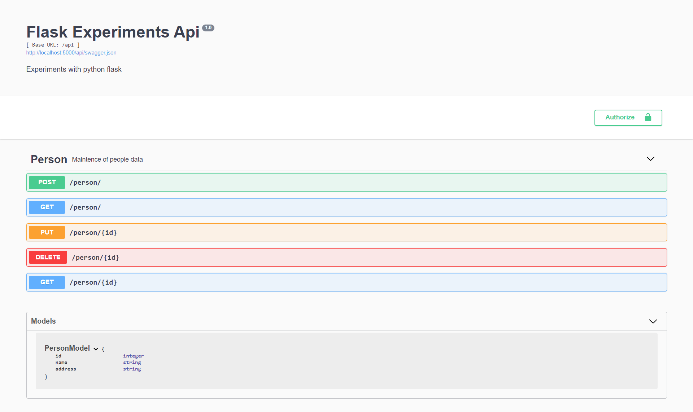
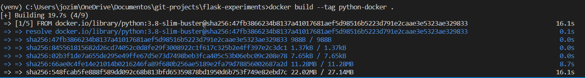

# Python Flask Experiments

Simple flask api tutorial with REST methods



[Criando api flask](https://jozimarback.medium.com/criando-api-python-flask-com-swagger-a3ccfa531bd8)

[Integration tests](https://jozimarback.medium.com/integration-test-with-flask-api-cf1b6fc4be4d)

### Running locally

1. Create virtual environment

```bash
python -m venv venv
```
2. Activate virtual environment
```bash
#linux
source venv/bin/activate
#windows
.\venv\Scripts\actvate
```
3. Install packages
```bash
pip install -r requirements.txt
```
4. Run app
```bash
python -m flask run --host=0.0.0.0
```


### Running on Docker

1. Create a build from present Dockerfile in this project

```bash
docker build --tag python-docker .
```



2. Run Docker container created on step 1
```bash
docker run -d -p 5000:5000 python-docker
```


### Acessing on browser

After runing with docker ou manualy on your machine, open a browser and navigate to http://localhost:5000 🎈
